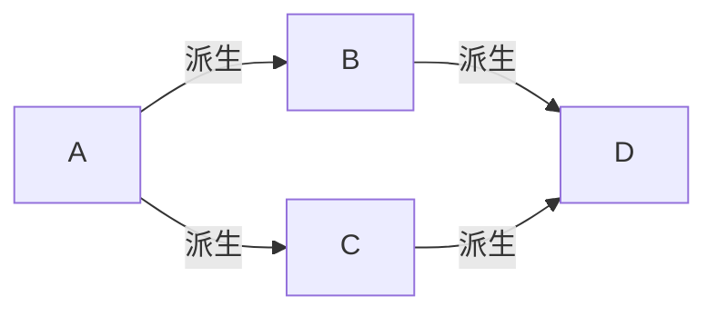

# 一、基于过程的程序设计

## 1.1 概念及基础
* `#pragma once`	//防止头文件重复包含
* 自定义的头文件用`" "`，系统的用`< >`

* **在标准输入流与输出流中使用控制符需要添加#include iomanip头文件**

  C++教材p50页

  有设置基数10、16、8；填充字符；设置精度；字段宽度；输出左对齐右对齐；输出正数给+

  ```C++
  cout<<setiosflags(ios::fixed)<<setiosflags(ios::right)<<setprecision(2);
  //输出数据右对齐，取两位小数
  ```

  

* **putchar和getchar 进行字符的输入和输出**

  * c=getchar() 无参数
  * C++兼容C语言的scanf和printf
    * scanf("%d %c %f",&a,&c,&b);
    * printf("a=%d,b=%f,c=%c\n",a,b,c)

* **switch结构** 

```C++
switch(c)  //括号中可以是数值类型的数据（包括char类型）
{
    case 0:###;break;		//当c与case后的表达式相同时，执行此句
    case 1:###;break;		//冒号后可以是好几句代码，break
        ……
    default:###;			//若所有表达式都不满足，则执行default子句的内嵌语句
        					//default不需要break；同时也可以没有default
}
```

* **C++提供了两种类型的字符串表示形式**

  * C风格字符串

    | Index        | 0       | 1       | 2       | 3       | 4       | 5       |
    | ------------ | ------- | ------- | ------- | ------- | ------- | ------- |
    | **Variable** | H       | e       | l       | l       | o       | \0      |
    | **Address**  | 0x23451 | 0x23452 | 0x23453 | 0x23454 | 0x23455 | 0x23456 |

  * C++引入的**string类**类型
    * 定义字符串string str="Hello";
    * 复制字符串str1=str2;
    * 连接字符串str=str1+str2;
    * 计算字符串长度str.size()
  
* **内置函数（内联函数）**

  ```c++
  #include<iostream>
  using namespace std;
  inline int max(int,int,int);	//可以在声明和定义函数时写inline，也可以只在函数声明时加
  int main()                    //inline，而定义时不加。
  {
      int i=10,j=20.k=30,m;
      m=max(i,j,k);          //编译时直接将max函数体的代码替换此句，同时将实参代替形参
      cout<<m;			  
      return 0;
  }
  inline int max(int a,int b,int c)  
  {
      if(b>a)a=b;
      if(c>a)a=c;
      return a;
  }
  ```

* 函数的重载：重载函数的参数个数，参数类型，或者参数顺序中必须至少有一种不同

* 函数模板：建立一个通用函数，其函数类型和形参类型不具体指定，用一个虚拟的类型来代表，这个通用函数就是函数模板。

  ```C++
  #include<iostream>
  using namespace std;
  template<typename T>
  T max(T a,T b,T c)
  {
      if(b>a)a=b;
      if(c>a)a=c;
      return a;
  }
  int main()
  {
      int a1=1,a2=2,a3=3;
      double b1=0.1,b2=0.2,b3=0.3;
      int i;double j;
      i=max(a1,a2,a3);		//调用函数模板，此时T被int取代
      j=max(b1,b2,b3);		//调用函数模板，此时T被double取代
  }
  ```

* 函数模板的一般形式为

  ```C++
  template<typename T>
  通用函数定义
  或（二者等价）
  template<class T>
  通用函数定义
  ```

  * **函数模板只适用于函数体相同、函数的参数个数相同、而类型不同的情况**。同时类型参数可以不止一个，可以根据需要确定个数如：

    ```c++
    template<class T1,typename T2>
    ```

* 有默认参数的函数，暂时仅作了解

* C++中变量除了有数据类型的属性以外，还有**存储类别**的属性：**自动的auto，静态的static，寄存器的register，外部的extern**

  * **自动变量auto**：auto可以省略，大多数变量都是自动变量

  * **静态局部变量**:对静态局部变量是在编译时赋初值，即只**赋值初值一次**，以后每次调用函数时不再重新赋初值，而是保留上一次函数调用结束的值

    ```C++
    int f(a)
    {
        static int c=1;	//c是静态局部变量，只赋一次初值，再次调用时屏蔽此句
        c=c+1;
        return a+c;
    }
    int main()
    {
        cout<<f(1)<<' '<<f(1);	//输出结果：3，4
    }
    ```

    * 虽然静态局部变量在函数调用结束后仍然存在，但是别的函数**不能引用它**

  * **寄存器变量**：有些变量使用频繁（如在一个函数中执行10000次，每次循环都引用某局部变量），使用寄存器存放大大提高效率(**编译器会自动识别高频变量并设置为register variable**，无需程序员指定，了解即可)

    ```
    register int i=1;
    ```

  * **全局变量（外部变量）**：作用域从变量的定义处开始到本程序文件的末尾

    ```
    file1.cpp
    extern int a,b; //外部变量声明,两个文件链接后执行file1此句时，编译器先在本文件中找a，b
    int main()		//定义，找不到就去file2中找
    {
    cout<<a<<b;
    }
    
    file2.cpp
    int a=3,b=4;
    
    
    ```

* 用static声明静态外部变量：如果希望某些外部变量只限于被本文引用，而不能被其他文件引用，此时可以在定义外部变量时加一个static声明，**为程序的模块化、通用性提供了方便**：

  ```
  file1.cpp
  static int a=3;
  ...
  
  file2.cpp
  extern int a;  //虽然有此句，但file2仍然无法使用file1中的a
  ...
  ```

* 根据函数是否能被其他源文件调用，将函数区分为**内部函数和外部函数**

  * 内部函数：只能被本文件中其他函数所调用

    ```
    static int func(int a,int b)
    ```

  * 外部函数：定义函数时省略extern，默认为外部函数

    ```
    extern int func(int a,int b)
    ```
* **控制台停止**
system("pause");
### 1.1.1生成随机数
#include\<ctime\>
srand(time(0));
rand()%100  生成0~99区间内的随机数
### 1.1.2字符数组与字符串

* 字符数组可以一次性定义，但不可一次赋值，只能分别对每个数组元素赋值

  ```
  char C[5];
  C={'C','h','i','n','a'};	//错误！
  C[0]='C',C[1]='h'... 		//正确！
  ```

  

* **字符串操作函数**(需要#include<cstring>)

  * 字符串连接函数**strcat**，是string catenate的缩写

    函数原型**strcat(char[],const char[])**

    ```c++
    char str1[30]="People's Republic of";
    char str2[]="China";
    cout<<strcat(str1,str2);	//调用strcat函数
    输出：
    	People's Republic of China
    ```

  * 字符串赋值函数**strcpy**

    函数原型**strcpy(char[],const char)**

    ```c++
    char str1[10],str2[]="China";
    strcpy(str1,str2);
    //执行后str2中的5个字符和'\0'被复制到str1中
    ```

  * 字符串比较函数**strcmp**,是string compare的缩写

    函数原型strcmp(const char[],const char[])

    ```C++
    strcmp(str1,str2);
    strcmp("China","Beijing");
    strcmp(str1,"China");
    //以上写法均合法
    ```

    * 如果两字符串相等，返回0
    * 字符串1>字符串2，返回正整数
    * 字符传1<字符传2，返回负整数
    * **字符串比较规则是：自左至右逐个字符比ASCII码**

  * 字符串长度函数**strlen**,返回字符串实际长度，**不包括'\0'**

    函数原型strlen(const char[]);

* C++提供全新的数据类型——字符串类型（string类型）
  * 需要#include<string>
  * 字符串赋值直接只用=
  * 字符串连接直接使用+
  * 字符串比较直接使用关系运算符
  * **String类型的长度固定一般为16字节**
  
* 指针法表示数组元素

  ```c++
  int a[10];
  int *p=a;
  for(int i=0;i<10;i++)
  	cin>>*(p+i);
  for(p=a;p<(a+10);p++)
      cout<<*p;
  ```

* C++有三种方法访问一个字符串

  * 字符数组存放字符串

    ```
    char str[]="I love China";
    ```

  * 用字符串变量存放字符串

    ```
    string str="I love China";
    ```

  * **用字符指针指向一个字符串**

    ```
    char *str="I love China";
    ```

### 1.1.3指针与引用

* 指针变量也可以指向一个函数。函数再编译时被分配给一个入口地址，**这个函数入口地址就成为函数的指针**。可以用一个指针变量指向函数，然后通过该指针变量调用此函数。

  ```C++
  int max(int x,int y);	//函数声明
  int (*p)(int,int);		//定义指向函数的指针变量p
  p=max;					//使p指向函数max
  int m=p(1,2);			//通过p调用函数max
  ```

* 指针数组

  ```
  int *p[4];		//由于[]优先级高，p先和[]结合成为数组，然后数组元素的类型是int *
  ```

* 指向指针的指针

  ```
  char *(*p);
  或
  char **p;
  ```

  ```c++
  char **p;
      char *arr[]={"BASIC","FORTRAN","C++","Pascal"}; 
      p=arr+2;
      cout<<*p<<endl<<**p;
  ```

  **arr[2]中存放了字符串"C++"的第一个字符的地址，因此cout<<*p就是从第一个字符开始输出字符串"C++"。\*\*p，应该理解为\*(\*p)，即\*\*p存放的是p所指向内容的地址，即C的地址，故cout<<\*\*p输出的是C；**
  

* const指针

  * 指向常量的指针变量（**经定义后，不允许通过指针变量改变它指向对象的值**）

    ```C++
    int a=12，b=15;
    const int *p=&a;	//定义了p为指向整型变量a的const指针变量
    *p=13;			//试图通过p改变它指向的对象a的值，非法
    p=&b;			//p改为指向b，合法
    a=15;			//直接改变a的值，合法
    ```

    ```
    const int a=12;	//要想绝对保证a的值不变，应该把a定义为常变量
    //这样p就成为了指向常变量的指针变量，无论直接访问方式还是间接访问方式都无法改变a的值
    ```

    **常变量和常量的区别**：变量是再运行时赋值，常量是在编译时赋值。常变量是在程序执行时赋值，只是值不再改变而已。

    **说明**：**如果一个变量已经被声明为常变量，则只能用指向常变量的 指针指向它**

  * 常指针（**指针的指向不能改变**）

    ```C++
    char *const p1="China";		//p1是字符指针变量，其指向不能改变
    p1="Canada";				//试图改变p1的指向，非法
    ```

  * 指向常量的常指针（**结合上面两种，即指针指向一个固定的对象，且不能通过指针改变该对象的值**）

    ```c++
    int a=10;
    const int *const p=&a;
    ```

* 其实上述常指针，和指向常量的指针很简单

  ```C++
  const int *p=&a;		//*p左边代表p指向的类型，故p指向常量
  char *const p="China";	//const位于*和p之间，代表p是一个常指针，不可以更换指向目标
  ```

* void指针类型：**“指向空类型“或者”不指向确定的类型“**

* 指针额外知识点

  * 指针可以有空值，即该指针变量不指向任何变量

    ```
    p=NULL;
    //一般情况编译系统中iostream里已经定义了符号常量NULL代表0 #define NULL 0
    //p=NULL就是使p指向地址为0的单元，即p不指向任何有效的单元
    ```

  * 两个指针变量可以相减

    * 如果两个指针变量**指向同一个数组的元素**，则两个指针的差就是两个指针之间的元素个数

      ```
      //假设p1指向a[1],p2指向a[4]
      p2-p1=3;
      ```

  * 两个指针变量比较

    * 若两个指针变量**指向同一个数组的元素**，则可以进行比较。指向前面的元素的指针变量小于指向后面元素的指针变量。

      ```
      //假设p1指向a[1],p2指向a[4]
      p1<p2的值为true;
      ```

* 引用

  * 引用的作用是**给变量起别名**
  * 声明一个引用时，必须同时使之初始化


### 1.1.4结构体类型

* 结构体变量的初始化
  * 可以在定义结构体时指定初始值
  * 也可以在定义变量时进行初始化

* 指向结构体变量的指针

  ```C++
  Student *p=&stu;
      cout<<p->Name;
      cout<<(*p).score;	//注意观察两种输出方式
  ```

### 1.1.5new和delete运算符

* new

  ```C++
  new int;	//开辟一个存放整数的存储空间，返回一个指向该 存储空间的地址（即指针）
  new int(100);	//除了上述操作外，指定该整数的初值为100
  new char[10];	//开辟一个存放字符数组（包含10个元素）的空间，返回字符数组首元素地址
  new int[5][4];	//开辟一个存放二维数组（大小为5*4）的空间，返回首元素地址
  float *p=new float(3.14159)	//开辟一个存放单精度数的空间，并指定该数初值为3.14159，将该空间的地址赋给指针变量p
  ```

  **注意：用new分配数组空间时不能指定初值，如果由于内存不足无法正常分配空间，new会返回一个空指针NULL**

* delete

  ```C++
  delete p;	//撤销上面用new开辟的存放单精度数的空间
  char *pt=new char[10];
  delete [] pt;	//撤掉该数组空间
  ```

### 1.1.6枚举类型

* 定义：如果有一个变量只能有几种可能的值，可以定义为枚举（enumeration)类型。

  ```C++
  enum weekday{sun,mon,tue,wed,thu,fri,sat};
  ```

  weekday为枚举类型。sun,mon,tue...称为**枚举元素或枚举常量**，它们时用户自定义的标识符

* 说明

  * 枚举元素按常量处理，故称**枚举常量**，他们不是变量，**不能对他们赋值**，即枚举元素的值时固定的

    ```
    sun=0;	//错误
    ```

  * 枚举元素作为常量，它们是有值的，其值**是一个整数**，编译系统按定义时的顺序对他们赋值为0,1,2...

    ```C++
    weekday workday;	//定义枚举变量workday
    workday=mon;	//把枚举常量mon的值赋给枚举变量workday,workday的值等于1
    cout<<workday;	//输出结果为1，而不是字符mon
    ```

  * 也可以在声明枚举类型的时候自己指定枚举元素的值，如

    ```C++
    enum weekday{sun=7,mon=1,tue,wed,thu,fri,sat};
    ```

  * 枚举值可以用来做判断比较，规则**按整数比较进行**

  * 不能把一个整数直接赋给一个枚举变量，枚举变量只能接受枚举类型数据，如

    ```C++
    workday=tue;	//正确
    workday=2；		//错误，它们属于不同类型
    
    workday=(weekday)2;	//正确，C语言的强制转换
    workday=weekday(2);	//正确，C++风格的强制转换
    ```

### 1.1.7typedef

* **typedef的作用相当于取别名**

  ```C++
  typedef int INTEGER;
  //如此，以下两行等价
  int i,j;
  INTEGER i,j;
  ```

* 也可以对一个结构体类型声明一个新的名字

  ```C++
  typedef struct{
  	int month;
  	int day;
  	int year;
  }DATE;
  DATE birthday;
  DATE *p;
  ```

* 还可以进一步用typedef声明一个新的类型名

  ```C++
  typedef int NUM[100];	//声明NUM为整型数组类型，包含100个元素
  NUM n;		//定义n为包含100个整形元素的数组
  
  typedef char * STRING;	//声明STRING为char *类型，即字符指针类型
  STRING p,s[10];
  
  typedef int(*POINTER)();	//声明POINTER为指向函数的指针类型，函数返回整型值
  POINTER p1,p2;
  ```

* typedef定义的一般用纯大写

* 定义结构体时同时定义该结构体类型的指针，可以这样写

  ```C++
  typedef struct Node
  {
      int num;
      Node *next;
  }*PNode;
  ```
### 1.1.8基本数据类型占用字节数

```cpp
short takes 2 Bytes
int takes 4 Bytes
long takes 4 Bytes
long long takes 8 Bytes
```
### 1.1.9 引用
* 引用的本质：给变量起别名
* 注意事项：1.引用必须初始化`int &a=b;` 2.引用一旦初始化就不可更改
* 引用作函数参数：1.值传递2.地址传递3.引用传递
```cpp
#include<iostream>
using namespace std;
//值传递
void swapValue(int a,int b)
{
    int temp=a;
    a=b;
    b=temp;
}
//地址传递
void swapAddress(int *a,int *b)
{
    int temp=*a;
    *a=*b;
    *b=temp;
}
//引用传递
void swapQuote(int &a,int &b)
{
    int temp=a;
    a=b;
    b=temp;
}
int main()
{
    int a=1,b=2;
    swapAddress(&a,&b);
    cout<<"a="<<a<<",b="<<b<<endl;
    swap(a,b);
    cout<<"a="<<a<<",b="<<b;
}
```
* 引用作为返回值
1. 不要返回局部变量的引用
2. 函数的调用可以作为左值（**实质：引用是别名，相当于一个变量名**）
```cpp
using namespace std;
int&func()
{
    static int a=10;
    return a;
    注意这里返回的是a不是&a,因为a是名字，返回值是别名类型已经一致
}
int main()
{
	这里的func()相当于是一个变量名,引用的实质是别名
    func()=20;
    cout<<func();
}
```

* 引用的本质
本质：引用的本质在C++内部实现是一个指针常量（*指针的指向不能修改*）
```cpp
void func(int&ref)	系统自动转换为 int*const ref
{
    ref=30;			系统自动转换为 *ref=30
}

int main()
{
    int a=10;	

    int&ref=a;	系统自动转换为int*const ref=&a
    			将a的地址放在ref中
    ref=20;		系统自动转换为 *ref=20;
    
    func(a);
    
}
```
### 1.1.10 常量引用
**作用**：常量引用主要用来修饰形参，防止误操作
**知识点**：
1.非常量引用的初始值必须为左值

2.常量引用则可以直接引用值
```cpp
	const int& ref = 10; 
	编译系统自动将代码转换为：int temp=10;const int&ref=temp;
	cout << ref;
```
3.加上`const`后变成只读状态，不能修改

使用场景：用来修饰形参，防止误操作
```cpp
int& ref = 10;	操作非法！
const int& ref = 10;	操作合法！
加上const后系统自动转换为：int temp=10; const int&ref=temp;
```
### 1.1.11指针
* 指针占用的内存空间
32位OS下占4字节,**无论什么数据类型的指针**（开发一般都是32位环境x86）
64位OS下占8字节(x64)
* **空指针**：指针变量指向内存中编号为0的空间
用途：初始化指针变量
注意：**空指针指向的内存是不可访问的**（0~255内存是OS占用的不可访问）
* **野指针**：指针变量指向非法的内存空间


没有申请就访问一块内存，会产生访问权限冲突。在程序中要避免野指针的出现。
### 1.1.12this指针
**this指针指向被调用的成员函数所属的对象**
this指针的用途：
1.当形参和成员变量同名时，可用this指针来区分
2.在类的非静态成员函数中返回自身，可使用return *this
  (用于链式调用）
```cpp
class Saler {
public:
	Saler(int = 0);
	Saler& addIncome(int n) {	注意返回值用引用接收
		income += n;
		return *this;			返回的是自身本体
	}
	int income;
};
Saler::Saler(int a):income(a){}
int main()
{
	Saler Mike;
	Mike.addIncome(10).addIncome(10).addIncome(20);
}
```
**`Saler addIncome(int n){...}`返回的不是引用，则会调用拷贝构造函数，返回一份拷贝而不是本体**
* **空指针访问成员函数**
```cpp
class Person {
public:
	void showName() {
		cout << "Name=" << name << endl;	系统自动添加this.name
	}
private:
	string name;

};
int main() {
	Person* p = NULL;
	p->showName();	代码崩溃,因为this指向当前函数所属对象，但空指针无指向对象
}
```
为了增加程序的健壮性，我们添加`if(this==NULL) return;`在函数中
## 1.2零碎知识点
### 1.2.1生成随机数
```cpp
#include<iostream>
#include<ctime>
using namespace std;
int main()
{
    srand(time(0));
    cout<<rand()%10+1<<endl;
}
```
### 1.2.2 goto跳转语句

### 1.23 函数的分文件编写
**swap.h**
```cpp
#include<iostream>
using namespace std;
void swap(int&,int&);
```
**swap.cpp**(名字不一定要相同）
```cpp
#include"swap.h"
void swap(int &a,int &b){
    int temp=a;
    a=b;
    b=temp;
}
```
**main.cpp**
```cpp
#include"swap.h"
void swap(int &a,int &b){
    int temp=a;
    a=b;
    b=temp;
}

```
### 1.2.4 string相关问题
直接定义string类型不需要导包
用到string相关方法，或用到cout需要导包\<string\>
### 1.2.5static
**静态局部变量**
特点：
1.该变量在全局区分配内存
2.只能初始化一次，在声明处初始化，如果未初始化系统会自动初始化
3.始终驻留全局区，直到程序结束。但是作用域仅为函数内
用法：
1.在循环中，若赋初值操作只想用一次
```cpp
	int count = 0;
	while (count<5) {
		static int i = 0;	i被声明为static后，这句话只会执行一次
		count += i;			后续循环不再赋予初值
		i++;
	}
```
## 1.3 函数
### 1.3.1函数默认参数
```cpp
void sumNum(int a, int b = 10, int c = 20) {
	cout << "sum=" << a + b + c << endl;
}
int main() {
	sumNum(10);
}
```
* 注意事项：
1.如果某个位置已经有默认参数，那么从这往右的参数都必须有默认值
2.如果函数声明有默认参数，函数实现就不能有默认参数（函数的声明和实现只能有一个有默认参数）
### 1.3.2 函数重载
* 函数重载条件：
前提：**函数作用域相同**
1.函数参数**类型不同**
 2.函数参数**个数不同** 
 3.函数参数**顺序不同**
 注意：**返回值不能作为重载的条件**
 * 函数重载两个特殊情形
1.引用作为重载条件
const int& 和 int& 视为不同类型
```cpp
void func(int&n)
{
    cout<<"int&"<<endl;
}
void func(const int&n)
{
    cout<<"const int&"<<endl;
}
int main()
{
    int a=10;
    func(a);	
    func(10);	因为int&n=10不合法！ const int&n=10合法!
    			系统自动转换为int temp=10;const int&n=temp;
}
```
2.尽量避免函数重载和默认参数同时出现
```cpp
void func(int a,int=10)
{
    cout<<a;
}
void func(int a)
{
    cout<<a;
}
int main()
{
    func(20);	此时编译系统不知道要调用哪个函数，故无法重载
    func(10,20);	合法，不产生二义性
}
```
### 1.3.3指针和函数


# 二、基于对象的程序设计
## 2.0 内存分区模型
C++程序在执行时，将内存大方向分为**4个区域**
* 代码区：存放函数体的二进制代码，由操作系统进行管理
* 全局区：存放全局变量和静态变量以及常量
* 栈区：由编译器自动分配释放，存放函数的函数值，局部变量等
* 堆区：由程序员分配和释放，若程序员不释放，程序结束时由OS回收

内存分区的意义：
  不同区域存放的数据，赋予不同的生命名周期，给我们更大的灵活编程
### 2.0.1 程序运行前
在程序编译后，生成exe可执行文件前，**未执行该程序前**分为两个区域
**代码区**：
  * 存放着CPU执行的机器指令
  * 代码区是共享的，目的对于频繁被执行的程序，只需要在内存中有一份代码即可
  * 代码区是只读的，防止程序意外地修改它的指令

**全局区**：
* 存放全局变量和静态变量
* 全局区还包括常量区，存放字符串常量和const修饰的变量
* **该区域的数据在程序结束后由操作系统释放**
```cpp
using namespace std;
int&func()
{
    static int a=10;
    return a;
}
int main()
{
    func()=20;
    cout<<func();
}
```
### 2.0.2 程序运行后
**栈区**
* 存放函数的参数值，局部变量等
* 由编译器自动分配释放
* 注意：不要返回局部变量的地址，栈区开辟的数据由编译器自动释放
```cpp
int*func(){
    int a=10;
    return &a;
}

int main(){
    int *p=func();
    cout<<*p;
局部变量a存放在栈区，由OS决定该地址的内容是否释放，不能保证输出的一定是10
}
```
**堆区**
由程序员分配释放，若程序员不释放，程序结束时由操作系统回收
C++中主要利用new在堆区开辟内存
### 2.0.3 new操作符
* new的基本语法
```cpp
#include<iostream>
using namespace std;
int*func(){
    return new int(10);

}
int main(){
    int *p=func();
    cout<<*p;
    system("pause");
}

```
* 在堆区利用new开辟数组
```cpp
#include<iostream>
using namespace std;
int*func(){
    return new int(10);

}
int main(){
    int *p=func();
    cout<<*p;
    system("pause");
}

```
### 2.0.4delete操作符
释放数组空间需要加上`[]`:`delete [] arr;`
## 2.1类和对象
### 2.1.0对象的特性
1. **空对象占用1字节存储**（面试可能会），目的是区分不同空对象在内存中的位置，每个空对象也应该有一个独一无二的内存地址
2. 成员变量和成员函数是分开存储的，**除了非静态成员变量属于对象，其他都不属于对象**（静态成员变量、非静态成员函数、静态成员函数）
### 2.1.1基本概念

* 面向对象程序设计有4个主要特点：**抽象、封装、继承、多态**
* 多态性：**由继承而产生的不同派生类，其对象对同一消息会作出不同的相应**
   如同样是双击操作，windows下，对可执行文件双击就会执行此程序，对文本文件就会启动文本编辑器并打开该文件
  
* 类代表了某一批对象的共性和特征。**类时对象的抽象，而对象时类的具体实例**，也可以说，**类是对象的模板**。

* 类是抽象的，不占用内存，而对象是具体的，占用存储空间。

  ```C++
  class Student
  {
      private:
  	int num;
  	char name[20];
      public:
  	void display(){
  		cout<<"num="<<num;
  		cout<<"name="<<name;
  	}
  };
  Student stu1,stu2;
  ```

* 如果在类的定义中既不指定private，也不指定public，则**系统默认是私有的**

* 私有成员(private),只能被本类中的成员函数引用，类外不能调用（友元类除外）

* 公用成员（public），既可以被本类中的成员函数所引用也可以被类的作用域内的其他函数引用

* 受保护的成员(protected),不能被类外访问，但是可以被派生类的成员函数访问

* **建议先写public部分，因为这样可以使用户将注意力集中在能被外界调用的成员上**
* 当其他类对象作为本类成员，构造的时候先构造类对象，再构造自身。析构时满足**先构造的后析构，后构造的先析构**原则

### 2.1.2类的成员函数

* **工具函数**：有的函数不是准备为外界调用的，而是为本类中的成员函数所调用的，就应该将他们指定为private，这种函数的作用是支持其他函数的操作，是类中其他成员的**工具函数**（utility function),用户不能调用这些私有的工具函数

* 在类外定义成员函数

  ```C++
  class Student
  {
  	...
  }
  void Student::display()
  {
  	...
  }
  ```

* 内置成员函数

  * 使用inline的原因：规模很小的函数，调用的开销比执行的开销更大，因此直接内置更高效
  * inline函数的作用是在调用该函数时，将函数的代码赋值插入到函数调用点，而若不用inline声明，在调用该函数时 ，流程转去函数代码的入口地址，在执行完该函数的代码段后，流程返回函数调用点
  * 只有在类外定义的成员函数规模很小而调用频率很高时，才指定为内置函数
  * 类内定义的成员函数可以**省略inline**，因为已被隐含地指定为内置函数
  * 类体外定义的函数，需要用**inline**显式声明

* 成员函数的存储方式
  * 不论成员函数是在类内定义还是在类体外定义，成员函数的代码段的存储方式是相同的，都不占用对象的存储空间。（**否则要为每个对象存储相同的代码段，对空间极大浪费**）
  * inline声明的成员函数，其代码段同样不占用对象的存储空间

### 2.1.3对象成员的引用

* 访问对象中的成员有三种方法

  * 通过对象名和成员运算符

  * 通过指向对象的指针

  * **通过对象的引用**

    ```C++
    Time t1;
    Time &t2=ti;
    cout<<t2.hour;
    ```

### 2.1.4类的封装性和信息隐蔽

* 公用成员函数是用户使用类的**公用接口（public interface）**，或者说是类对外接口
* 如同照相机拍照只需要按下快门，并不需要关心其内部的电路和机械结构是如何实现拍照的，这就是**接口与实现分离**

### 2.1.5类声明和成员函数定义的分离

* 实际上，一个C++程序是由3个部分组成的
  * 类声明头文件（后缀为.h)，可以理解为**用户使用类库的公用接口**
  * 类实现文件（后缀为.cpp)，包括类成员函数的定义
  * 类的使用文件（后缀为.cpp)，即主文件

### 2.1.6面向对象程序设计中的几个名词

* 三个术语：**对象、方法、消息**

```
stud.display();
```

stud是**对象**，display（）是**方法**，调用一个对象的方法（如stud.display())就是一个发对对象的**消息**，要求对象执行一个操作

### 2.1.7 C++三个文件分离

* **#include后面用双引号引起来 " " **,不要用< >

* 主文件（即类的使用文件），后缀为.cpp

  ```C++
  #include<iostream>
  #include "time.h"
  int main()
  {
      ...
  }
  ```

* 类声明头文件，后缀为.h

  ```C++
  class Time
  {
  public:
      void setTime();
      void showTime();
  private:
      int hour;
      int minute;
      int sec;
  };
  ```

* 类的实现文件，**包括类成员函数的定义**,后缀为.cpp

  ```C++
  #include<iostream>
  #include "time.h"
  using namespace std;
  void Time::setTime()
  {
      cout<<"Enter hour,minute,sec:";
      cin>>hour>>minute>>sec;
  }
  void Time::showTime()
  {
      cout<<"Time is "<<hour<<'h'<<minute<<"min"<<sec<<'s'<<endl;
  }
  ```
### 2.1.8struct和class的区别
C++中struct和class唯一的区别就在于**默认的访问权限不同**
1.struct默认访问权限为public
2.class默认权限为private
## 2.2怎样使用类和对象
### 2.2.1利用构造函数对类对象进行初始化

* 如果一个类中的所有成员**都是公用的**，则可以在**定义对象**的时候对数据成员进行初始化

  ```C++
  class Time
  {
  	public:
  		int hour;
  		int minute;
  };
  Time t1={11,23};
  ```

* C++提供**构造函数**(Constructor)来处理对象的初始化。构造函数是一种特殊的成员函数，与其他成员函数不同，不需要用户来调用它，而是在建立对象时自动执行。

* 构造函数的名字**必须与类名相同**，它不具有任何类型，不返回任何值

* 可以用一个类对象初始化另一个类对象，**此时不调用构造函数**，调用拷贝构造函数

  ```C++
  Time t1;
  Time t2=t1;	//建立对象t2，并用t1初始化t2	
  ```
* **注意**：`Person p();`不能调用默认构造函数，编译系统会认定其为函数声明；调用默认构造函数直接写`Person p;`
### 2.2.2带参数的构造函数

```C++
class Box
{
public:
	Box(int,int,int);
private:
	int height;
	int width;
	int length;
}
Box::Box(int h,int w,int len)
{
	height=h;
	width=w;
	length=len;
}
int main()
{
	Box box1(12,25,30);
}
```

### 2.2.3用参数初始化表对数据成员进行初始化

```C++
Box::Box(int h,int w,int len):height(h),width(w),length(len){}
```

* **如果数据成员是数组，则应当在构造函数的函数体中用语句对其赋值，而不能用参数初始化表对其初始化**

  ```c++
  class Student
  {
  public:
  	Student(int n,char s,char nam[]):num(n),sex(s)
  	{
  		strcpy(name,nam);
  	}
  private:
      int num;
      char sex;
      char name[20];
  };
  
  Student stu1(10101,'m',"Wang_li");
  ```

### 2.2.4构造函数的重载

* 一个类中可以定义多个构造函数，以便为对象提供不同的初始化方法。这些构造函数具有相同的名字，**而参数的个数或者参数的类型不相同**，创建对象时，据此系统自动选择对应的构造函数

  ```C++
  Box();
  Box(int h,int w,int len):height(h),width(w),length(len){}
  Box::Box()
  {
      height=10;
      width=10;
      length=10;
  }
  int main()
  {
      Box box1;
      Box box2(12,13,14);
  }
  ```

### 2.2.5使用默认参数的构造函数

* 带默认参数的构造函数的意思是，如果不输入其某项数据，该项数据将取默认值

* 应该在**声明构造函数时**指定默认值，而不能只在定义构造函数时指定默认值

* 声明构造函数时，形参名可以省略

  ```
  Box(int=10,int=10,int=10);
  ```

* 全部参数都指定了默认值的构造函数也属于**默认构造函数**，**一个类只能由一个默认构造函数**，也就是说**无参数而调用的构造函数，一个类只能由一个**

  ```C++
  Box();						//声明了一个无参的构造函数
  Box(int=10,int=10,int=10);	//声明了一个全部都指定了了默认值的构造函数
  ```

* 一个类中定义了全部是默认参数的构造函数后，不能再定义重载构造函数。**因为会产生歧义**

  

```C++
class Box
{
public:
	Box(int h=10,int w=10.int len=10);	//使用默认参数（形参给定值）
    //或Box(int=10,int=10,int=10);
private:
	int height;
	int width;
	int length;
};
Box::Box(int h,int w,int len)
{
	height=h;
	width=w;
	length=len;
}
//或Box::Box(int h,int w,int len):height(h),width(w),length(len){}
int main()
{
	Box box1;	//不指定参数，各参数取默认值
	Box box2(15);	//只给定一个实参，剩下的取默认值
	Box box3(15,30);	//只给定两个实参，剩下的取默认值
	Box box4(12,30,20);	//给定3个实参
}
```

```C++
//上面类体外对构造函数的声明也可以写成参数初始化表的形式
Box::Box(int h,int w,int len):height(h),width(w),length(len){}
```

### 2.2.6析构函数

* **析构函数的作用并不是删除对象，而是撤销对象占用的内存空间之前完成一些清理工作**，使这部分内存可以被程序分配给新对象使用。

* 析构函数不返回任何值，没有函数类型，也没有函数参数，**不能被重载**，一个类有多个构造函数，但是**只能有一个析构函数**

* 实际上，析构函数的作用并不仅限于释放资源，还可以被用来执行**用户希望在最后一次使用对象之后所执行的任何操作**，例如输出相关信息。

  ```C++
  ~Student()
  {
  	cout<<"Destructor called.";	
  }
  ```

* **先构造的后析构，后构造的先析构**

### 2.2.6对象数组

* 如果构造函数只有一个参数,定义数组时可以直接在等号后面的花括号内提供实参

  ```
  Student stu[3]={3,2,13};
  ```

* 如果有多个参数

  ```C++
  Student stu[3]={
  	Student(1001,12,39);	//调用第一个元素的构造函数，向他提供3个实参
  	Student(1002,13,23);	//调用第二个元素的构造函数，向他提供3个参数
  	Student(1003,14,78);	//调用第三个元素的构造函数，向他提供3个参数
  };
  ```

### 2.2.7对象指针

* 对象空间的起始地址就是对象的指针

  ```C++
  Time *pt;
  Time t1;
  pt=&t1;
  //通过指针访问对象的成员
  (*pt).hour
  pt->hour
  
  (*pt).get_time()
  pt->get_time()
  ```

### 2.2.8指向对象成员的指针

* 指向对象数据成员的指针

  ```C++
  int *p;
  p=&t1.hour;
  cout<<*p;
  ```

* 指向对象成员函数的指针

  * **定义指向对象成员函数的指针变量的方法和定义指向普通函数的指针变量方法有所不同**

    ```C++
    //指向普通函数的指针变量
    void(*p)();	//p是指向void型函数的指针变量
    p=fun;
    (*p)();		//调用fun函数
    
    //指向对象成员函数的指针变量
    //需要三步
    void(Time::*p2)();	//定义p2是一个指向Time类成员函数 返回值为void 的指针
    p2=&Time::get_time;		//注意！此处get_time后不加括号
    (t1.*p2)();		//调用t1的get_time成员函数
    ```

* **this指针**：它是指向本类对象的指针常量（不可修改指向），它的值是当前被调用的成员函数所在对象的起始地址

### 2.2.9公用数据的保护

* **常对象**

  * 在常对象的生命周期中，t1所有数据成员的值都不能被修改
  * 可以在定义对象时加关键字**const**，指定对象为**常对象**。**常对象必须有初值**。

  ```C++
  Time const t1(12,34,56);	
  或
  const Time t1(12,34,56);
  ```

  * **常对象只能调用常函数**

    ```C++
    const Time t1(12,34,56);
    t1.get_time();	//非法！试图用调用t1的普通成员函数
    ```


 * 声明**常成员函数**

    ```
    void get_time()const;
    ```
```cpp
class Person {
public:
	void showName()const	this指针的本质是Person*const this 指针常量
	{				常成员函数相当于把this变成了const Person*const this
		name = "YUfengxu";	name其实是this->name
	}
private:
	string name;

};
```
  * 常成员函数可以访问常对象中的数据成员，但**不允许修改**常对象中的数据成员的值

  * C++考虑到实际编程的需要，将数据成员声明为**mutable**，这样就可用**常成员函数**修改它的值

    ```
    mutable int count;
    ```
```cpp
public:
	void showName()const
	{
		name = "YUfengxu";	即使是常成员函数，加了mutable也能修改
	}
private:
	mutable string name;
```
  * **总结一下就两条：1.只有常成员函数能访问常对象，但不能修改数据成员**

    							   **2.只有声明为muable的数据成员，才能被常成员函数修改**

* **常对象成员**

  可以将对象的成员声明为const，包括常数据成员和常成员函数

  * **常数据成员**

    只能通过构造函数的参数初始化表对常数据成员进行初始化，任何其他函数都不能对常数据成员赋值

    ```C++
    const int hour;
    //不能采用在构造函数中队常数据成员赋初值
    Time::Time(int h)
    {
    	hour=h;		//非法，不能对之赋值
    }
    ```

    ```C++
    //应当写成
    Time::Time(int h):hour(h){}
    ```

  * **常成员函数**

    ```C++
    void get_time()const;
    ```

    * 调用时不必加const

    * 常成员函数可有引用const数据成员，也可以引用非const数据成员

      | 数据成员              | 普通成员函数             | const成员函数            |
      | --------------------- | ------------------------ | ------------------------ |
      | 非const的普通数据成员 | 可以引用，也可以改变值   | 可以引用，但不可以改变值 |
      | const数据成员         | 可以引用，但不可以改变值 | 可以引用，但不可以改变值 |
      | const对象             | 不允许                   | 可以引用，但不可以改变值 |

    * 总结一下就是：const成员函数只能引用，不能改变值；普通成员函数要看情况

  * **指向对象的常指针**

    将指针声明为const型，这样指针变量始终保持为初值，不能改变，**即其指向不变**

    ```C++
    Time t1(10,12,15),t2;
    Time *const p;
    p=&t1;
    p=&t2;	//错误，p不能改变指向
    ```

  * **指向常对象的指针变量**

    与前面所说的指针和其所指向变量的关系，是一致的。指向常变量的指针可以指向const和非const型的变量，而指向非const型变量的指针只能指向非const的变量

    只需将“变量”替换为“对象”即为对象与指针的规则

    * 如果一个对象已经被声明为常对象，则只能用指向常对象的指针指向它。

    * 如果定义了一个指向常对象的指针，并使它指向一个非const对象，则其指向的对象**不能通过该指针变量来改变**

    * **总之，常指针不能改变方向，指向常变量/常对象的指针不能通过指针修改目标值**（除非将涉及到的成员函数都设置为const，涉及到的数据成员都设置为mutable）

      ```C++
      Time t1(10,12,15);
      const Time *p=&t1;
      t1.hour=12;		//合法
      (*p).hour=15;	//非法，不能通过指针变量改变t1的值	
      ```

      ```C++
      //如果希望任何情况下t1的值都不能被改变，应该把他定义为const型
      const Time t1(10,12,15);
      ```

      **注意区别 常指针和指向常对象的指针，不同的定义方法**

      ```C++
      Time *const p;	//指向对象的常指针
      const Time *p;	//指向常对象的指针变量
      ```

* 对象的常引用

  如果不希望在函数中修改实参t1的值，可以吧fun函数的形参t声明为const（常引用）

  ```C++
  void fun(const Time &t);	
  ```

  **在C++面向对象程序设计中，经常用到常指针和常引用作为函数参数。这样既能保证数据安全，使数据不能被随意修改，在调用函数时又不必建立实参的拷贝**，常指针和常饮用作函数参数，可以提高程序效率

  **const型数据小结**				

| 形式                  | 含义                                                         |
| --------------------- | ------------------------------------------------------------ |
| Time const t          | t是常对象，其值任何情况下都不能改变                          |
| void Time::fun()const | fun是Time类的常成员函数，可以引用，但是不能修改本类中的数据成员 |
| Time *const p         | p是指向Time类对象的常指针，p的指向不能改变                   |
| const Time*p          | p是指向Time类**常对象**的指针，**不能通过p改变目标值**       |
| const Time&t1=t       | t1是Time类对象t的**常引用**，二者指向同一存储空间，**t的值不能改变** |

### 2.2.10对象的动态建立和释放

```C++
Box *pt;
pt=new Box;

cout<<pt->height;
cout<<pt->volume();
```

```C++
Box *pt=new Box(12,15,16);	//可以在执行new时，对新建立的对象进行初始化
```

在执行delete**运算符**时，在释放内存空间之前，自动调用析构函数，完成相关善后清理工作

```
delete pt;		//释放pt所指向的内存空间
```

### 2.2.11对象的赋值和复制(拷贝构造函数）

* 对象的赋值

  ```C++
  Student stu1,stu2;
  ...
  stu2=stu1;
  ```
  **注意**，用此方式赋值，类的数据成员中不能包括动态分配的数据，否则在赋值时会出现严重后果

* 对象的复制

  ```
  Box box2(box1);	//用已有的对象box1去复制出一个新的对象box2
  ```

  * 编译系统自动调用**复制构造函数**，而不会去调用其他构造函数

  * 如果用户未定义复制构造函数，则编译系统会自动提供一个默认的复制构造函数，其作用是简单地复制类中的每个数据成员

  * C++还提供另一种方便用户的复制形式，但**作用都是调用复制构造函数**

    ```
    Box box2=box1,box3=box2;
    ```
```cpp
    Student(const Student&stu)
    {
        cout<<"Copy-Constructor running!"<<endl;
        age=stu.age;
        sex=stu.sex;
    }
```
### 2.2.12静态成员

* 静态数据成员（**即类的各对象共享的数据，只要修改，因为所有对象都引用这一值，故都改变**）

  * 静态数据成员不是说数据保持不变，而是说**静态数据成员属于类，不是对象，但类的对象可以引用它**,如果改变它的值，则在各对象中这个数据成员的值都同时改变了。

  ```C++
  class Box{
  public:
  	int volume();
  private:
  	static int height;		//将height定义为静态的数据成员
  	int width;
  	int length;
  };
  int Box::height=10;		//只能在类体外初始化
  ```

  * **静态数据成员可以初始化，但只能在类体外进行初始化**
  * 在编译阶段（程序还未运行）分配内存（全局区）

  * 不能用参数初始化表对静态数据成员进行初始化

  * **静态数据成员既可以通过对象名引用，也可以通过类名来引用**

    ```C++
    cout<<a.height;
    cout<<Box::height;
    ```
  
* 静态成员函数

  * **静态成员函数属于类的一部分而不是对象的一部分，如果要在类外调用公用的静态成员函数，要用类名和域运算符`::`**

    ```C++
    static int volume();
    Box::volume();
    a.volume();
    ```

  * 静态成员函数与非静态成员函数的根本区别：非静态成员函数有**this指针**，而静态成员函数由于属于类而**没有this指针**,由此决定了**静态成员函数不能访问本类中的非静态成员**

  * 静态成员函数可以直接引用本类中的**静态成员**，因为静态成员同样属于类。

  * C++中，**静态成员函数主要用来访问静态数据成员，而不访问非静态成员**，假如在一个静态成员函数中有以下语句

    ```C++
    cout<<height<<endl;	//height已声明为satic，合法
    cout<<width<<endl;	//width非静态成员，错误
    ```

    如果一定要用静态成员函数访问本类的非静态成员，**只是不能进行默认访问**，因为无法知道去找哪个对象

    ```C++
    cout<<a.width;		//用静态成员函数访问本类中非静态成员
    ```

  * C++程序员应该养成这样的习惯：**只用静态成员函数引用静态数据成员，而不引用非静态数据成员**

### 2.2.13友元

* 将普通函数声明为友元函数

  ```C++
  class Time
  {
  public:
  	Time(int,int,int);
  	friend void display(Time &);	//声明display函数为Time类的友元函数
  }
  
  void display(Time &t)
  {
      cout<<t.hour;
  }
  ```

* 友元成员函数

  **注意在调用非本类中的成员时，必须加上对象名**，如display()是另一个函数的友元函数，调用其内容时必须加上其对象名

  ```C++
  class Date;		//对Date类的提前引用声明
  class Time
  {
  public:
  	Time(int,int,int);
  	void display(Date &);	//display是成员函数，形参是Date类对象的引用
  private:
  	int hour;
  	int minute;
  	int sec;
  };
  
  class Date
  {
  public:
  	Date(int,int,int);
  	friend void Time::display(Date &);	//声明Time中的display函数为本类的友元成员函数
  private:
  	int month;
  	int day;
  	int year;
  };
  
  void Time::display(Date &d)
  {
      cout<<d.month;		//注意在输出Date类的对象中成员时，必须加上对象名d.month
  }
  ...
      
  int main()
  {
  	Time t1(10,13,26);
      Date d1(12,25,2004);
      t1.display(d1);		//调用t1中的display函数，实参是Date类对象d1
  }
  ```

* 友元类

  **不仅可以将一个函数声明为一个类的“朋友",还可以将一个类B声明为另一个类A的“朋友”，这时B类就是A类的友元类**，B中的所有函数都时A类的友元函数，可以访问A类中的所有成员

  * **友元类的关系时单向的**
  * **友元类的关系不能传递**

### 2.2.14类模板/参数化的类

* **类模板是类的抽象，类是类模板的实例**

* 类模板可以有一个或多个虚拟的参数类型

  ```C++
  template <class numtype>
  class Compare
  {
  public:
     Compare(numtype a,numtype b);
      {x=a;y=b;}
      numtype max()
      {return(x>y)?x:y;}
      numtype min()
      {return(x<y)?x:y;}
  private:
      numtype x,y;
  };
  ```

  **其中numtype只是表示“数据类型”的意思而已，这个名字可以任意取，只要是合法的标识符即可**

* 如何使用类模板

  ```C++
  Compare <int> cmp(4,7)；
  ```

* 可以这样声明和使用类模板

  * 首先，写出一个实际的类，由于其语义明确，不容易出错
  * 然后，将此类中准备改变的类型名，改用一个自己指定的虚拟类型名（如numtype)
  * 最后，在类声明前加上一行**template <class 虚拟类型参数>**

* **在类模板外声明成员函数**，前提是声明和类模板必须放在同一文件中

  ```C++
  template<class T1,class T2>	//
  T1 Compare<T1,T2>::max(){...};
  ```

  

### 2.2.15仿函数&匿名对象
```cpp
class myPrint
{
public:
	void operator()(string str)
	{
		cout << str;
	}
};
int main()
{
	myPrint obj;
	obj("第一个字符串");
	cout << endl;
	myPrint()("第二个字符串");	使用了匿名对象
}
```

## 2.3运算符重载
**本章知识点最全最正确的案例**
*Tips:前置运算符返回引用（引用传递），后置运算符返回值（值传递）*
```cpp
#include<iostream>
using namespace std;
class Complex {
public:
	//默认构造函数
	Complex() {
		real = 0;
		imag = 0;
	}

	//带参构造函数
	Complex(double r,double i)
		:real(r),imag(i){}

	//重载运算符+
	Complex operator+(Complex c) {
		return Complex(real + c.real, imag + c.imag);
	}

	//运算符函数也可以重载
	Complex operator+(double num) {
		return Complex(real + num, imag);
	}

	//重载运算符<<
	friend ostream& operator<<(ostream& output, Complex c);

	//重载运算符>>
	friend istream& operator>>(istream& input, Complex &c);

	//重载运算符前置++
	Complex& operator++()
	{
		real++;
		return *this;
	}

	//重载运算符后置++	返回的是值不是引用，即后置++不能链式使用
	Complex operator++(int)
	{
		Complex c(*this);
		//或Complex c=*this;  两种方式都可以调用拷贝构造函数
		real++;
		return  c;	//值传递
	}
private:
	double real;
	double imag;
};
ostream& operator<<(ostream& output, Complex c)
{
	if (c.imag >= 0)
		output << c.real << "+" << c.imag << "i";
	else
		output << c.real << c.imag<<'i';
	return output;
}
istream& operator>>(istream& input, Complex &c)
{
	input >> c.real >> c.imag;
	return input;
}
```
<<运算符重载参数写成引用的话，须这样写
```cpp
#include<iostream>
using namespace std;
class Complex {
public:
	//默认构造函数
	Complex() {
		real = 0;
		imag = 0;
	}

	//带参构造函数
	Complex(double r,double i):real(r),imag(i){}

	//重载运算符+
	Complex& operator+(Complex &c) {
		//不能返回局部变量的引用，new在堆区创建对象在函数执行后才不会被销毁
		return *(new Complex(real + c.real, imag + c.imag));
		//new返回的是地址，要解引用
	}

	//运算符函数也可以重载
	Complex& operator+(int num) {
		Complex*p=new Complex(real + num, imag);
		return *p;	//解引用
	}

	//重载运算符<<
	friend ostream& operator<<(ostream& output, Complex&c);

	//重载运算符>>
	friend istream& operator>>(istream& input, Complex& c);

	//重载运算符前置++
	Complex& operator++()
	{
		real++;
		return *this;
	}

	//重载运算符后置++
	Complex& operator++(int)
	{
		real++;
		return *this;
	}
private:
	int real;
	int imag;
};
ostream& operator<<(ostream& output, Complex& c)
{
	if (c.imag >= 0)
		output << c.real << "+" << c.imag << "i";
	else
		output << c.real << c.imag<<'i';
	return output;
}
istream& operator>>(istream& input, Complex& c)
{
	input >> c.real >> c.imag;
	return input;
}
```
### 2.3.1运算符重载的方法

* 运算符重载的实质是函数的重载

* **函数类型 operator 运算符名称(形参表){对运算符的重载处理}**

* c1+c2，编译系统将它解释为**c1. <u>operator+</u> （c2）**  ，即通过对象c1调用运算符重载函数"operator+"，并以表达式中的第2个参数（运算符右侧的类对象c2）作为函数参数

  ```C++
  class Complex			//定义复数类
  {
  public:
      Complex(){real=0;imag=0;}
      Complex(double r,double i){real=r;imag=i;}
      Complex operator+(Complex &c2);      //声明重载运算符+的函数
      void display();
  private:
      double real;
      double imag;
  };
  
  Complex& Complex::operator+(Complex &c2)
  {
      Complex *c=new Complex(real+c2.real,imag+c2.imag);
      return *c;
  }
  ```

### 2.3.2 重载运算符的规则

* C++不允许用户自定义新的运算符，只能对已有的C++运算符进行重载

* C++允许重载的运算符，见红C++书p302

* 不能重载的运算符只有5个

  | 成员访问运算符     | .      |
  | ------------------ | ------ |
  | 成员指针访问运算符 | *      |
  | 域运算符           | ::     |
  | 长度运算符         | sizeof |
  | 条件运算符         | ?:     |

* 重载不改变运算符的优先级别

* 重载不能改变运算符的结合性

* 重载不能改变操作数的个数

* 重载运算符的函数不能由默认的参数，**否则就改变了运算符参数的个数**，与上面一点矛盾

* 重载的运算符必须和用户自定义的自定义类型的对象一起使用，其参数至少应该有一个是类对象（或类对象的引用）。也就是说，参数不能全部是C++的标准类型，以防止用户修改用于标准类型数据的运算符的性质

  ```C++
  int operator+(int a,int b)
  {return a-b;}			//错误！
  ```

* 用于类对象的运算符一般必须重载，**但有两个例外，运算符“=”和“&”不必用户重载**

### 2.3.3运算符重载函数作为类成员函数和友元函数

* 对运算符重载的函数有两种处理方式
  * 作为类的成员函数
  * 普通函数，声明为友元函数

```C++
class Complex
{
public:
    Complex(){real=0;imag=0;}
    Complex(double r,double i){real=r;imag=i;}
    friend Complex operator+(Complex &c1,Complex &c2);      //重载函数作为友元函数
    void display();
private:
    double real;
    double imag;
};

Complex& operator+(Complex&c1,Complex&c2)
{
	Complex* c=new Complex(c1.real+c2.real,c1.imag+c2.imag);
	return *c;
}

```

* 有的C++编译系统如Visual C++ 6.0没有完全实现C++标准，不支持把运算符重载函数作为友元函数，但是VisualC++6.0提供的老版本的带后缀.h的头文件可以支持 此功能，因此可以把程序头两行改为以下一行

  ```C++
  #include<iostream.h>
  ```

* 由于编译器是将c1+c2解释为**c1. <u>operator+</u> （c2）**  ，operator+整体作为前者对象的成员函数来调用，**如果第一个参数是int型，则运算符重载函数不能作为成员函数**，如果函数需要访问私有成员，则必须声明为**友元函数**

  ```C++
  //在Complex类中声明：
  friend Complex operator+(int &i,Complex &c);	//第一个参数可以不是类对象
  //在类外定义友元函数
  Complex& operator+(int &i,Complex &c)		//运算符重载函数不是成员函数
  {	Complex *c1=new Complex(i+c.real,c.imag);
  	return *c1;
  }
  ```

* 将**双目运算符重载为友元函数时，由于友元函数不是该类的成员函数，因此在函数的形参列表中必须有两个参数，不能省略**，形参的顺序任意。但是在使用运算符的表达式中，要求运算符左侧的操作数与函数第一个参数对应，右侧操作数与第二个参数对应：

  ```
  c3=i+c2;	//正确
  c3=c2+i;	//错误
  ```

  **如果想使用交换律，必须再重载一次运算符**

* 究竟是把运算符重载函数作为类的成员函数好，还是友元函数好？由于友元的使用会破坏类的封装，因此从原则上说，要尽量将运算符函数作为成员函数，但还应考虑到各方面的因素和程序员的习惯，以下可供参考

  * C++规定，`=,[],(),->`必须作为成员函数重载
  * 流插入`<<`和流提取运算符`>>`，类型转换运算符函数不能定义为类的成员函数，**只能作为友元函数**
  * 一般将单目运算符和复合运算符`+=,-=,/=,*=,&=,!=,^=,%=,>>=,<<=`重载为成员函数
  * 一般将双目运算符重载为友元函数

### 2.3.4重载双目运算符

* **注意！在其他普通函数中使用重载运算符时，只能以调用重载运算符函数的形式使用**

  ```C++
  void Compare(String &st1,String &str2)
  {
  	if(operator>(string1,string2)==1)	//在别的函数中，只能以operatir>( )的形式使用重载运											算符
  		...
  }
  ```

```cpp
struct Tuple {
    LL a, b, c;

    Tuple() {}

    Tuple(LL t1, LL t2, LL t3) : a(t1), b(t2), c(t3) {}

    bool operator<(const Tuple &t) const {	//注意这两个const必须要加
        return a < t.a || a == t.a && b < t.b || a == t.a && b == t.b && c < t.c;
    }
};
```


### 2.3.5重载单目运算符

```C++
Time Time::operator++()
{
    if(++sec>=60){
        sec-=60;
        ++minute;
    }
    return *this;
}
```

**后置++，增加一个int形参就可以实现**

```C++
Time Time::operator++(int)
{
    Time temp(*this);	//将当前对象的内容复制给新建的对象temp
    sec++;
    if(sec>=60){
        sec-=60;
        ++minute;
    }
    return temp;
}
```

**注意二者区别，前者是先自加然后返回修改后的自身；而后者返回的是自加前的对象，然后对象自加**（说白了就是返回一个还没改变的临时镜像，然后原来的对象自增）

### 2.3.6重载流插入运算符`<<`和流提取运算符`>>`

* 重载的函数形式如下

  ```C++
  istream & operator>>(istream &,用户自定义类&);
  ostream & operator<<(ostream &,用户自定义类&);
  ```

* 重载运算符`>>`的函数的第一个参数和函数的类型都必须是istream&类型，第二个参数是要进行输入操作的类。重载`<<`的函数的第一个参数和函数的类型都必须是ostream&类型，函数第二个参数是要进行输入操作的类。**因此只能将重载`<< >>`的函数作为友元函数，而不能将它们定义为成员函数**。(因为运算符重载为成员函数后，如果出现表达式`c1+c2`,编译系统会把它解释为`c1.operator+(c2)` )
* 为什么重载`<<`和`>>`不能用成员函数？**因为无法实现cout在左侧**!使用成员函数重载运算符后，对象在左边 p<<cout。因此必须用全局函数重载它们。
`operator<<(cout,p)`的简化形式是`cout<<p`

* **重载流插入运算符`<<`**

  在程序中，人们希望能用插入运算符`<<`来输出用户自己声明的类的对象的信息，这就需要重载`<<`

  ```C++
  class Complex	//定义复数类
  {
  public:
      Complex(){real=0;imag=0;}
      Complex(double r,double i){real=r;imag=i;}
      Complex operator+(Complex &c2);      //声明重载运算符+的函数
      friend ostream&operator<<(ostream&,Complex&);   //运算符<<重载为友元函数
  private:
      double real;
      double imag;
  };
  
  ...
      
  ostream&operator<<(ostream&output,Complex&c)
  {
      output<<'('<<c.real<<'+'<<c.imag<<"i)"<<endl;
      return output;
  }
  
  int main()
  {
      Complex c1(3,4),c2(5,-10),c3;
      c3=c1+c2;
      cout<<c3;
  }
  ```

* `cout<<c3`

  cout是头文件iostream中声明的ostream类对象，c3是Complex类对象，由于已将运算符`<<`的重载函数声明为Complex类的友元函数，**编译系统把cout<<c3解释为：<u>operator<<</u>(cout,c3)**,即以cout和c3作为实参，调用上面的`operator<<`函数。调用函数时形参output成为实参cout的引用，形参c成为c3的引用。

* `return output`的作用：output是cout的引用即别名，相当于`return cout`，将输出流cout的现状返回，即保留输出流的现状，**目的是连续向输出流插入信息**

  ```C++
  cout<<c3<<c2;
  //即
  (cout<<c3)<<c2;
  ```

  执行`(cout<<c3)`的结果就是具有新内容的流对象cout，因此`(cout<<c3)<<c2`相当于`cout(新值)<<c2`,**现在理解为什么C++规定运算符`<<`重载函数的第一次参数和函数的类型必须是ostream类型的引用了吧！就是为了返回cout当前值以便连续输出**

* **重载流提取符`>>`**

  C++预定义的运算符`>>`的作用是从一个输入流中提取数据，如`cin>>i`,表示从输入流中提取一个整数赋给变量i。**重载流提取符的目的是希望将`>>`用于输入自定义类型的对象的信息**

  ```C++
  #include<iostream>
  using namespace std;
  
  class Complex
  {
  public:
      Complex(){real=0;imag=0;}
      Complex(double r,double i){real=r;imag=i;}
      Complex operator+(Complex &c2);      //声明重载运算符+的函数
      friend ostream&operator<<(ostream&,Complex&);   //运算符<<重载为友元函数
      friend istream&operator>>(istream&,Complex&);   //运算符>>重载为友元函数
  private:
      double real;
      double imag;
  };
  
  Complex Complex::operator+(Complex &c2)
  {
      return Complex(real+c2.real,imag+c2.imag);
  }
  
  ostream&operator<<(ostream&output,Complex&c)
  {
      if(c.imag>=0)
          output<<'('<<c.real<<'+'<<c.imag<<"i)"<<endl;
      else
          output<<'('<<c.real<<c.imag<<"i)"<<endl;
      return output;
  }
  
  istream&operator>>(istream&input,Complex&c)
  {
      cout<<"Input real part and imaginary part of complex number:";
      input>>c.real>>c.imag;
      return input;
  }
  
  int main()
  {
      Complex c1,c2;
      cin>>c1>>c2;
      cout<<"c1="<<c1;
      cout<<"c2="<<c2;
  }
  ```
### 2.3.7赋值运算符重载
* **C++至少给一个类添加四个函数：**
1.默认构造函数
2.默认析构函数
3.默认拷贝构造函数
4.赋值运算符operator=,对属性值进行拷贝

* 如果不对赋值运算符进行重载，在堆区开辟内存了的类，如果进行`p1=p2`赋值运算，在销毁时可能会发生堆区内存重复释放
```cpp
#include<iostream>
using namespace std;
class Person
{
public:
	Person(int a) {
		//new在堆区开辟内存存放数字，返回地址
		agePointer = new int(a);
	}
	//在堆区开辟的内存，需要程序员自行销毁
	~Person() {
		//需要先判断是否指向空，因为如果指向空，不能对该指针进行detele操作
		//增强程序健壮性
		if (agePointer!= NULL) {
			delete agePointer;
			agePointer= NULL;
		}
	}
	int*agePointer;
};
void func()
{
	Person p1(10), p2(20);
	p1 = p2;
	函数执行完后p1，p2均会调用析构函数对堆区中同一块内存
	进行delete操作（重复释放），导致程序出错！
}
int main()
{
	func();
}
```
对赋值运算符operator=进行重载
```cpp
Person& operator=(Person &p)	返回引用以实现 p1=p2=p3
{
	先将自己占用的内存释放干净
	if (agePointer != NULL)
		delete agePointer;
	agePointer = new int(*p.agePointer);
	return *this;
}
```
### 2.3.8 ==和!=运算符重载
```cpp
class Car
{
public:
	Car(string b, string l)
	{
		brand = b;
		licenseNum = new string(l);
	}
	~Car()
	{
		if (licenseNum != NULL) {
			delete licenseNum;
			licenseNum = NULL;
		}
	}
	bool operator==(Car &c)
	{
		if (this == &c)
			return true;
		if (brand == c.brand && *licenseNum == *c.licenseNum)
			return true;
		return false;
	}
	bool operator!=(Car c)
	{
		return !(*this == c);
	}
private:
	string brand;
	string* licenseNum;
};
```
### 2.3.9 函数调用运算符（）重载
由于重载后使用的方式非常像函数的调用，因此被成为**仿函数**
仿函数没有固定的写法，非常灵活
## 2.4不同类型数据间的转换

### 2.4.1标准数据类型间的转换

* C++保留了C语言的强制转换方式`(int)89.5`,**提倡C++提供的方法`int(89.5)`**

### 2.4.2用构造函数进行不同类型数据的转换

* **转换构造函数**的作用是**将一个其他类型的数据转换成一个类的对象**

* 回顾以前学过的几种构造函数：

  * 默认构造函数

    ```
    Complex();	//没有参数
    ```

    

  * 用于初始化的构造函数

    ```
    Complex(double r,double i);	
    ```

  * 用于复制对象的复制构造函数

    ```
    Complex(Complex &c);	//形参是本类对象的引用
    ```

  * 现在要介绍一种新的构造函数——**转换构造函数**，转换构造函数只有一个形参，如

    ```C++
    Complex(double r){real=r;imag=0;}
    //这样就可以将一个double类型的数据 强制转换 为一个Complex类对象
    c=c1+Complex(2.5);	//运算符+已重载
    ```

    其作用是将double型的参数r转换成Complex类的对象，将r作为复数的实部，虚部为0。用户可以根据需要定义转换构造函数，在函数体中告诉编译系统怎样去进行转换

* **转换构造函数只能有一个参数，如果有多个参数的，它就不是转换构造函数**!原因是显然的，如果有多个参数，那么究竟将哪个转换为Complex对象呢？

* 不仅可以将一个标准数据类型转换为类对象，还可以将另一个类对象转换为 **转换构造函数**所在的类对象。如果，可以将一个学生类对象转换为教师类对象（学生毕业后当了老师），要求把某学生的编号、姓名、性别复制到一个教师类对象中，可以在**Teacher**类中写出如下的转换构造函数

  ```C++
  Teacher(Student&s){num=s.num;strcpy(name,s.name);sex=s.sex;}
  ```

  同时应注意，对象s中的num，name，sex必须是共用成员，否则不能被类外引用

### 2.4.3类型转换函数

* **类型转换函数的作用是将一个类的对象转换成另一个类型的数据**。如果已声明了一个Complex类，可以在Complex类中这样定义类型转换函数：

  ```C++
  operator double()
  {return real;}x`
  ```

  ```C++
  class Complex
  {
  public:
      Complex(){real=0;imag=0;}
      Complex(double r,double i):real(r),imag(i){}
      operator double(){return real;}     //定义类型转换函数
  private:
      double real;
      double imag;
  };
  
  int main()
  {
      Complex c1(3,4),c2(5,-10),c3;
      double d;
      d=2.5+c1;       //隐式地调用类型转换函数
      cout<<d<<endl;
  }
  ```
  
  **注意，函数名是<u>operator double</u>,函数没有参数**,其返回值的类型是由函数名中指定的类型名来确定的。**类型转换函数只能作为成员函数，因为转换的主体是本类的对象。不能作为友元函数或普通函数**。
  
  double类型经过重载后，除了原有的含义外，还获得新的含义（将一个Complex类对象转换为double类型数据，并指定了转换方法）。这样，编译系统不仅能识别原有的double型数据，而且还会把Complex类对象作为double型数据处理。**Complex类对象只有在需要的时候才进行转换，要根据表达式的上下文来确定**

**！！！注意，重载运算符+的友元函数时，参数不能使用引用，否则会导致类型转换出错**

```C++
#include<iostream>
using namespace std;

class Complex
{
public:
    Complex(){real=0;imag=0;}               //默认构造函数，无形参
    Complex(double r){real=r;imag=0;}       //转换构造函数，一个形参
    Complex(double r,double i){real=r;imag=i;}  //实现初始化的构造函数，两个形参
    friend Complex operator+(Complex c1,Complex c2);    //重载运算符+的友元函数
    						//注意此处没有使用引用，如果使用引用会导致无法类型转换
    void display();
private:
    double real;
    double imag;
};

Complex operator+(Complex c1,Complex c2)
{
    return Complex(c1.real+c2.real,c1.imag+c2.imag);
}

void Complex::display()
{
    cout<<'('<<real<<','<<imag<<"i)"<<endl;
}

int main()
{
    Complex c1(3,4),c2(5,-10),c3;
    c3=c1+2.5;  //复数与double数据相加
    c3.display();
}
```

* **程序分析**

  * 如果没有定义转换构造函数，则此程序出错，因为没有重载运算符能使之将Complex类对象与double数据相加，由于c3是Complex类对象，必须设法将2.5转换为Complex类对象，然后与c1相加，再赋值给c3

  * 现在，再类Complex中定义了**转换构造函数**，并具体规定了怎样构成一个复数。由于已经重载了运算符`+`，再处理表达式`c1+2.5`时，编译系统把他解释为

    ```
    operator+(c1,2.5);
    ```

    由于2.5不是Complex类对象，系统先调用**转换构造函数**Complex(2.5),建立一个临时的Complex类对象，其值是(2.5+0i)。相当于

    ```
    operator+(c1,Complex(2,5));
    ```

  * 如果把`c3=c1+2.5`改为`c3=2.5+c1`，**同样可以运行**！

  * **结论**

    * **在已经定义了相应转换构造函数的情况下，将运算符+函数重载为友元函数，在进行两个复数相加时，可以用交换律**
    * **如果运算符函数重载为成员函数，它的第一个参数必须是本类的对象。交换律不适用！**

* 因此，一般情况下**将双目运算符函数重载为友元函数，单目运算符则多重载为成员函数**

```C++
class Complex
{
public:
    Complex(){real=0;imag=0;}               //默认构造函数，无形参
    Complex(double r){real=r;imag=0;}       //转换构造函数，一个形参
    Complex(double r,double i){real=r;imag=i;}  //实现初始化的构造函数，两个形参
    operator double(){return real;}     //类型转换函数，无形参
    friend Complex operator+(Complex c1,Complex c2);    //重载运算符+的友元函数
    void display();
private:
    double real;
    double imag;
};
...
int main()
{
    Complex c1(3,4),c2(5,-10),c3;
    c3=c1+2.5;  //复数与double数据相加
    c3.display();
} 
```

**编译报错，原因是出现二义性**，在处理c1+2.5时，一种理解是调用转换构造函数将2.5变成Complex类对象，然后调用运算符+重载函数，与复数c1进行相加。另一种理解是，调用类型转换函数，把c1转换为double型数，然后与2.5进行相加。系统无法判定，这二者是矛盾的。如果要使用类型转换函数，就应删去运算符+重载函数。
## 2.4 对象的初始化和清理
### 2.4.1 构造函数的分类及调用
三类：**构造函数、拷贝构造函数、析构函数**
调用：
1.括号法
```cpp
Person p1;		默认构造函数（注意不要加括号，否则会被认为是函数声明）
Person p2(10);	有参构造函数
Person p3(p2);	拷贝构造函数
```
2.显示法
```cpp
Person p1;
Person p2=Person(10);	有参构造
Person p3=Person(p2);	拷贝构造
注意事项：不要用拷贝构造函数初始化匿名对象：Person(p2); 
```
3.隐式转换法
```cpp
Person p1=10;	系统会自动转换为Person p1=Person(10);
```
### 2.4.2 拷贝构造函数的调用时机
1.使用一个已经创建完毕的对象来初始化一个新对象
`Person p2(p1);`
2.值传递的方式给函数参数传值
```cpp
void func(Student stu) {
}
函数体为空，参数为类对象，函数参数值传递相当于拷贝一份临时的数据，会调用拷贝构造函数
```
3.值方式返回局部对象
```cpp
Student returnValue() {
	Student stu;
	return stu;	此时并不是返回上面的stu本身，而是返回一份拷贝数据
}
int main() {
	Student stu = returnValue();
}
运行结果：
默认构造函数调用
拷贝构造函数调用
析构函数调用
析构函数调用
```
### 2.4.3构造函数调用规则
默认情况下，C++编译器至少会给一个类添加三个函数
1.默认构造函数（无参，类体为空）
2.默认析构函数（无参，类体为空）
3.默认拷贝构造函数，对属性值进行拷贝

构造函数调用规则如下：
1.如果用户定义了有参构造函数，C++不再提供默认无参构造函数，但是会提供拷贝构造函数
2.**如果用户定义了拷贝构造函数，C++不再提供其他构造函数**
### 2.4.4深拷贝与浅拷贝问题（面试常考）
浅拷贝：简单的赋值拷贝操作(编译系统赠送的拷贝构造函数）
深拷贝：在堆区重新申请空间，进行拷贝操作

浅拷贝存在的问题：可能造成堆区内存的重复释放
```cpp
在此情况下，如果使用了浅拷贝的拷贝构造函数，将造成同一块内存区域的重复释放
原因：浅拷贝简单地把在堆区开辟的内存的地址复制到新的对象中
class Student
{
public:
    Student(int a,int h)
    {
        age=a;
        height=new int(h);	堆区开辟内存，使指针height指向该内存
    }
    ~Student()
    {
        if(height!=NULL)
        {
            delete height;
            height=NULL:
        }
    }
private:
    int age;
    int*height;
};

int main()
{
    Student stu1(22, 170);
    Student stu2(stu1); 
}
```
解决方法：自己实现拷贝构造函数
```cpp
    Student(const Student& stu) {
        age = stu.age;
        height = new int(*stu.height);
    }
```

# 三、面向对象的程序设计


## 3.1继承与派生

C++提供了类的继承机制，解决了**软件重用问题**

### 3.1.1继承与派生的概念

* **单继承**：一个派生类只从一个基类派生
* **多重继承**：一个派生类有两个或多个基类
* 派生类是基类的具体化，而基类则是派生类的抽象

### 3.1.2派生类的声明方式

```
class Student1:public Student

{派生类新增加的成员};
```

* **构造函数和析构函数不能从基类继承**，因此应当自己定义派生类的构造函数和析构函数
* **只能覆盖，不能舍弃基类成员**，可以在派生类中声明一个与基类成员同名的成员以覆盖（注意覆盖成员函数需要保持`函数类型，参数个数，参数类型`相同

### 3.1.3派生类成员的访问属性

* **公用继承**：**基类私有**不可访问（即**没有继承下来**，要访问还得用基类的成员函数），其他保持原有不变

* **私有继承**：**基类私有**不可访问，剩下的变为派生类的**私有成员**

  * 基类的**公用成员函数**变成了派生类的**私有成员函数**，不能直接调用

    ```C++
    using namespace std;
    class Student
    {
    public:
        void get_value(){
            cin>>num>>name>>sex;}
        void display()
        {
            cout<<"num:"<<num<<endl;
            cout<<"name:"<<name<<endl;
            cout<<"sex:"<<sex<<endl;
        }
    private:
        int num;
        string name;
        char sex;
    };
    
    class Student2:private Student      //私有继承
    {
    public:
        void get_value_1()
        {
            get_value();	//基类的公用函数被私有继承为私有函数，故只能通过基类函数调用它
            cin>>age>>addr;
        }
        void display_1()
        {
            display();
            cout<<"age:"<<age<<endl<<"address:"<<addr<<endl;
        }
    private:
        int age;
        string addr;
    };
    
    int main()
    {
        Student2 stu;
        stu.get_value();	//错误！基类的公用函数已被私有继承为私有函数，不能直接调用
        stu.get_value_1();	//正确，这是派生类的函数，通过其调用基类的共有成员函数
    }
    ```

    

* **受保护的继承**：**基类私有成员**不可访问，剩下的变成派生类的**受保护的成员**（外界不可访问，如用xx.num)

  保护继承的特点：保护基类的公有成员和保护成员都在派生类中成了保护成员，其私有成员仍未基类私有，也就是把基类原有的公有成员也保护了起来，不让类外任意访问

* 总之，基类私有不可被派生类访问，**只能通过基类的成员函数来引用**

* 实际中，公用继承用的最多，私有继承和保护继承方式用的很少，只需了解以便阅读别人写的程序时能理解

### 3.1.4派生类的构造函数

* 简单的派生类的构造函数

  ```C++
  class Student
  {
  public:
      Student(int n,string nam,char s):num(n),name(nam),sex(s){}
      ~Student(){}
  protected:
      int num;
      string name;
      char sex;
  };
  class Student1:public Student
  {
  public:
      Student1(int n,string nam,char s,int a,string ad):Student(n,nam,s)
      {
          age=a;
          addr=ad;
      }
      void show()
      {
          cout<<"num:"<<num<<endl;
          cout<<"address:"<<addr<<endl;
      }
      ~Student1(){}
  private:
      int age;
      string addr;
  };
  ```

  **注意派生类的构造函数**，Student(n,nam,s)不需要写类型，因为**相当于把前面传进来的参数摘给后边**

  ```C++
  Student1(int n,string nam,char s,int a,string ad):Student(n,nam,s)
      {
          age=a;
          addr=ad;
      }
  ```

  **如果在类内声明，类体外定义则不需写Student(n,nam,s)**

  ```C++
  //类内
  Student1(int n,string nam,char s,int a,string ad);
  //类外定义
  Student1::Student1(int n,string nam,char s,int a,string ad):Student(n,nam,s)
      {
          age=a;
          addr=ad;
      }
  ```

  **还可以直接使用常量或全局变量**

  ```C++
  Student1(int n,string nam,char s,int a,string ad):Student(10010,nam,s)
  ```

  **也可以用参数初始化表**

  ```C++
  Student1(int n,string nam,char s,int a,string ad):Student(n,nam,s),age(a),addr(ad){}
  ```

  执行构造函数和析构函数的顺序：

  1. 派生类构造函数先调用基类构造函数
  2. 再执行派生类构造函数本身（即派生类构造函数的函数体），上述例中：先初始化num,name,sex再初始化age,addr
  3. 在派生类对象释放时，先执行派生类析构函数，再执行基类析构函数

* 有子对象的派生类的构造函数

  指的是成员中含有对象的对象

  ```C++
  //基类中
  Student(int n,string nam):num(n),name(nam){}
  //派生类中
  public:
      Student1(int n,string nam,int n1,string nam1,int a,string ad)
      :Student(n,nam),monitor(n1,nam1)//派生类构造函数
      {
          age=a;
          addr=ad;
      }
  ...
  private:
      Student monitor;	//私有成员中含有类对象
      int age;
      string addr;
  ```

  派生类构造函数的任务包括三个部分

  1. 对基类数据成员的初始化
  2. 对子对象数据成员的初始化
  3. 对派生类数据成员初始化

### 3.1.5多层派生时的构造函数

```C++
class Student
{
public:
    Student(int n,string nam):num(n),name(nam){}
    void display()
    {
        cout<<"num:"<<num<<endl;
        cout<<"name:"<<name<<endl;
    }
protected:
    int num;
    string name;
};

class Student1:public Student
{
public:
    Student1(int n,string nam,int a):Student(n,nam)
    {
        age=a;
    }
    void show()
    {
        display();
        cout<<"age:"<<age<<endl;
    }
private:
    int age;
};

class Student2:public Student1
{
public:
    Student2(int n,string nam,int a,int s):Student1(n,nam,a)
    {
        score=s;
    }
    void show_all()
    {
        show();
        cout<<"score:"<<score<<endl;
    }
private:
    int score;
};
```

### 3.1.6派生类构造函数的特殊形式

* 不需要对派生类新增的成员进行任何初始操作时，派生类构造函数的函数体可以为空

  ```C++
  Student2(int n,string nam,int a,int s):Student1(n,nam,a){}
  ```

* 另一种怪麻烦的，请查谭浩强C++第三版P356页
### 3.1.7继承后子类是否保留父类数据
**子类中所有非静态成员变量都会保留到子类中**
```cpp
class Father
{
public:
	int a;
protected:
	int b;
private:
	int c;
};

class Son :public Father
{
public:
	int d;
};

int main()
{
	cout << "Son的大小是" << sizeof(Son) <<"字节"<< endl;
	输出结果是16字节，说明子类完全地保留了父类的数据
}
```
使用VS自带的工具开发者命令提示工具可以查看类的结构
1.找到文件路径，输入如下命令
`D:\Codes\VisualStudioProjects\Project01\继承后的父类数据是否拷贝>cl /d1 reportSingleClassLayoutSon 源.cpp`
```
class Son       size(16):
        +---
 0      | +--- (base class Father)
 0      | | a
 4      | | b
 8      | | c
        | +---
12      | d
        +---
```
### 3.1.8继承中的构造和析构顺序
创建一个子类对象，其中构造函数和析构函数的顺序如下：
1.父类构造函数
2.子类构造函数
3.子类析构函数
4.父类析构函数
**面试题**：创建一个子类对象会不会有父类对象的创建？**答：有！**


### 3.1.9继承中的同名成员处理
加上作用域::即可。
**注意一下情形**：子类中的同名函数会隐藏掉父类中所有同名函数（包括所有重载形式）需要加作用域才能调用

**继承同名静态成员的处理方式**：
1.同名静态数据成员（编译阶段分配内存，类内声明，类外初始化）
2.同名静态成员函数
处理方式仍然是加上父类作用域以访问父类静态成员
有两种方式:
1.Father::num  
2.Son::Father::num
## 3.2多重继承(multiple inheritance)
*实际开发中不建议使用多继承*
### 3.2.1多重继承的声明

```C++
class D:public A,private B,protected C
{类D新增加的成员}
```

### 3.2.2多重继承派生类的构造函数

```C++
Graduate(string nam,int a,char s,string t,float sco,float w):
        Teacher(nam,a,t),Student(nam,s,sco),wage(w){}
```

### 3.2.3多重继承引起的二义性问题

* 第一种情况：两基类有同名成员

  加上限定符即可，如c1.A::display(); 若在派生类C中的成员函数访问基类A的display,则A::display();

*  第二种情况：两个基类和派生类三者都有同名成员，即有3个display函数

  答案时：会产生**覆盖**，基类的同名函数（注意要保持函数类型、参数个数、参数类型相同，否则就是**重载**）被派生类函数覆盖

* 如果类A和类B是从同一个基类N派生的

  应该加上限定符`A::`或`B::`,如`c1.A::a=3;c1.A::display();`//要访问的是类N的派生类A中的基类成员

## 3.3解决菱形继承问题——虚基类
菱形继承：子类继承两份相同的数据，导致资源浪费以及含义的冲突（如年龄）
### 3.3.1虚基类的作用
C++提供**虚基类**virtual base class的方法，使得**在继承简介共同基类时只保留一份成员**

现在将类A声明为虚基类，**虚基类是在声明派生类时，指定继承方式时声明的！**
```cpp
class A
{...};
class B:virtual public A
{...};
class C:virtual public A
{...};
```
### 3.3.2虚基类的初始化
如果在虚基类中定义了带参数的构造函数，而且没有定义默认构造函数，则在其所有派生类（包括直接派生类和间接派生类）中，通过构造函数的初始化表对虚基类进行初始化。
**在最后的派生类中不仅要负责对其直接基类进行初始化，还要负责对虚基类进行初始化，因为只有一份数据**，如果由B和C分别初始化，会造成数据不一致发生矛盾

```cpp
class A
{A(int i){}		//基类构造函数，有一个参数
..}
class B:virtual public A
{B(int n):A(n){}
...};
class C:virtual public A
{C(int n):A(n){}
...};
class D:public B,public C
{D(int n):A(n),B(n),C(n){}	//D类构造函数，在初始化表中对所有基类初始化
...}
```
**C++编译器只执行最后的派生类对虚基类的构造函数的调用，忽略其他的，保证虚基类的数据成员不会被多次初始化**
**多重继承容易产生二义性问题，如果能用单一继承解决得问题不要使用多重继承**
### 3.3.3基类与派生类的转换
1. 派生类对象可以向基类对象赋值，**相反则不可以**
2. 派生类对象可以替代基类对象向基类对象的引用进行赋值或初始化

```cpp
假设已定义Point类，和派生类Circle
Circle c(1,2,3);//输出的是半径为3的圆
Point&p=c;	//p和c共享 基类Point那一段存储空间
此时p是c的部分引用，注意是部分！p共享c的基类那一部分存储空间，故
cout<<p;	//输出的是(1,2)点信息
```
3. 如果函数的参数是基类对象或基类对象的引用，相应的实参可以用子类对象

```cpp
如有一函数fun
void fun(A&r)			//形参是A类对象的引用
{cout<<r.num<<endl;}	//输出该引用中的数据成员num
//在调用fun函数时可以用派生类B的对象b1作实参
fun(b1);
```
4. 指向基类对象的指针变量也可以指向派生类对象，但通过指向基类对象的指针只能访问派生类中的基类成员，而不能访问派生类增加的成员

## 3.4继承与组合

```cpp
using namespace std;
class Teacher
{
public:
    Teacher(int n,string nam,char s):num(n),name(nam),sex(s){}
    void display()
    {
        cout<<"num="<<num<<endl;
        cout<<"name="<<name<<endl;
        cout<<"sex="<<sex<<endl;
    }
private:
    int num;
    string name;
    char sex;
};

class BirthDate
{
public:
    BirthDate(int y,int m,int d):year(y),month(m),day(d){}
    void display()
    {
        cout<<year<<'/'<<month<<'/'<<day<<endl;
    }
private:
    int year;
    int month;
    int day;
};

class Professor:public Teacher
{
public:
    Professor(int n,string nam,char s,int y,int m,int d)
    :Teacher(n,nam,s),birthday(y,m,d){}
    void show()
    {
        Teacher::display();	//对同名函数加上限定符
        birthday.display();
    }
private:
    BirthDate birthday;
};

```
## 3.5多态性与虚函数
### 3.5.1多态性的概念
多态的实质：父类引用指向子类对象
多态性：**向不同的对象发送同一消息，不同的对象在接收时会产生不同的行为**（即方法），分为**静态多态性**和**动态多态性**。
1. 静态多态性的应用即**函数的重载和运算符重载**,**编译阶段确定函数地址**
2. 动态多态性的特点是：在程序运行过程中动态地确定操作所针对的对象，又称**运行时的多态性**，是通过**虚函数**来实现的。**运行阶段确定函数地址**
### 3.5.2静态多态性

```cpp
using namespace std;
class Point		//点类
{
public:
    Point(float x=0,float y=0);
    void setPoint(float,float);
    float getX()const{return x;}    //读x坐标，getX函数为常成员函数
    float getY()const{return y;}    //读y坐标，getY函数为常成员函数
    friend ostream&operator<<(ostream&,const Point&);//友元重载运算符<<
protected:
    float x,y;
};

Point::Point(float a,float b)
{
    x=a;y=b;
}

void Point::setPoint(float a,float b)
{
    x=a;y=b;
}

ostream&operator<<(ostream&output,const Point&p)    //重载运算符<<，使之能输出点的坐标
{
    output<<'['<<p.x<<','<<p.y<<']'<<endl;
    return output;
}

//派生类Circle
class Circle:public Point
{
public:
    Circle(float x=0,float=0,float=0);//带默认参数的构造函数
    void setRadius(float);  //设置半径值
    float getRadius()const; //读取半径值 常成员函数不能修改数据
    float area()const;      //计算圆面积  设置为常成员函数不能修改数据
    friend ostream&operator<<(ostream&,const Circle &); //重载运算符"<<",使之能输出Circle类对象
protected:
    float radius;
};
//定义构造函数，对圆心坐标和半径初始化
Circle::Circle(float a,float b,float r):Point(a,b),radius(r){}
//设置半径
void Circle::setRadius(float r)
{
    radius=r;
}
//读取半径值
float Circle::getRadius()const
{
    return radius;
}
//计算面积
float Circle::area()const
{
    return 3.14159*radius*radius;
}
//重载运算符“<<"，使之能按规定的形式输出圆的信息
ostream&operator<<(ostream&output,const Circle&c)
{
    output<<"Center=["<<c.x<<','<<c.y<<"],r="<<c.radius<<",area="<<c.area()<<endl;
    return output;
}

//Cylinder是Circle的公用派生类（圆柱体）
class Cylinder:public Circle
{
public:
    //带默认参数的构造函数，若对应数据项不输入则取默认值
    Cylinder(float=0,float=0,float=0,float=0);
    //构造函数初始化
    /*Cylinder(float a,float b,float r,float h)
    :Circle(a,b,r),height(h){} 定义了全部都是默认参数的构造函数后不能再重载构造函数，否则会发生矛盾*/
    void setHeight(float h){height=h;}
    float getHeight()const{return height;}
    float volume()const;
    friend ostream&operator<<(ostream&,const Cylinder&);    //运算符重载只能声明为友元函数，申明为成员函数默认参数为本类对象
private:
    float height;
};
Cylinder::Cylinder(float a,float b,float r,float h)
:Circle(a,b,r){height=h;}
ostream&operator<<(ostream&output,const Cylinder&c)
{
    output<<'['<<c.x<<','<<c.y<<"],r="<<c.radius<<",height="<<c.height<<",volume="<<c.volume()<<endl;
}

float Cylinder::volume()const
{
    return area()*height;
}

int main()
{
    Cylinder c;
    cout<<c;
    Circle&cir=c;		//此时cir部分引用Cylinder类对象c，
    cout<<cir;			//输出的是c的Circle基类部分
    Point&po=c;
    cout<<po;
}


```
### 3.5.3利用虚函数实现动态多态性
所谓虚函数就是在基类声明函数是虚拟的，并不是实际存在的函数，然后在派生类中才正式定义此函数。在程序运行期间，用指针指向某一派生类对象，这样就能调用指针指向的派生类对象中的函数，而不会调用其他派生类中的函数。
注意：**虚函数的作用是允许在派生类中重新定义与基类同名的函数，并且可以通过基类指针或引用来访问基类和派生类中的同名函数。**
**虚函数的使用方法是**：
1. 在基类中用virtual声明成员函数为虚函数。在类外定义虚函数时不必再加virtual
2. 在派生类中重新定义此函数，函数名、函数类型、参数个数和类型必须与基类的虚函数相同，根据派生类的需要重新定义函数体。
当一个成员函数被声明为虚函数后，其派生类中的同名函数**都自动成为虚函数**。因此在派生类重新声明该虚函数时可以加virtual，也可以不加。**但是习惯上一般在每一层声明该函数时都加virtual，使程序更清晰**。
3. 定义一个指向基类对象的指针变量，并使它指向同一类族中需要调用该函数的对象。
4. 通过该指针变量调用此虚函数，此时调用的就是指针变量指向的对象的同名函数

```cpp
Student stud1(1001,"Li",99);
    Graduate grad1(2001,"Wang",98,1200);
    Student*pt=&stud1;
    pt->display();
    pt=&grad1;	//指向基类对象类型的指针，直接修改指向
    pt->display();
```
未定义虚函数时，结果是：

```cpp
num:1001
name:Li
score:99

num:2001
name:Wang
score:98	//调用了基类对象的display()函数
```
定义虚函数后，结果是：

```cpp
num:1001
name:Li
score:99

num:2001
name:Wang
score:98
wage=1200	//调用了子类对象的display()函数
```
### 3.5.4在什么情况下应当声明虚函数
 * 使用虚函数需要注意以下两点
    1. 不能将类外的普通函数声明为虚函数
    2. 一个成员函数被声明为虚函数后，在同一类族中的类就不能再定义一个非virtual得但与该虚函数具有相同得参数和函数返回值类型得同名函数
* 根据什么考虑把一个成员函数声明为虚函数
  1. 首先看成员函数所在的类是否会作为基类。然后看成员函数再类的继承后有无可能被更改功能，如果希望其更改功能的，一般应声明为虚函数
  2. 如果成员函数在类被继承后功能无需修改，或在派生类中用不到该函数，则不要把他声明为虚函数。
  3. 应考虑对成员函数的调用是通过对象名还是通过基类指针或引用去访问，如果是通过基类指针或引用去访问，则应当声明为虚函数。‘
  4. 有时，在定义虚函数时，并不定义其函数体，即函数体是空的。它的作用只是定义了一个虚函数名，具体功能留给派生类去添加。
* 需要说明的是：使用虚函数，系统有一定的时空开销。当一个类带有虚函数时，编译系统会为该类构造一个虚函数表(virtual function table，简称vtable)，它是一个指针数组，存放每个虚函数的入口地址，系统在进行动态关联时的时间开销是很小的，因此，**多态性是高效的**。 
### 3.5.5虚析构函数
析构函数的作用是在对象撤销之前做必要的“清理现场”的工作。当派生类的对象从内存中撤销时，一般先调用派生类的析构函数，然后调用基类的析构函数。但是如果用new运算符建立了临时对象，若基类中有析构函数，并且定义了一个指向该基类的指针变量。在程序中用delete运算符撤销对象时，会发生一个情况：系统只会执行基类的析构函数，而不执行派生类的析构函数。

```cpp
#include<iostream>
using namespace std;
class Point
{
public:
    Point(){}
    ~Point(){cout<<"Executing Point destructor"<<endl;}
};

class Circle:public Point
{
public:
    Circle(){}
    ~Circle(){cout<<"executing Circle destuctor"<<endl;}
private:
    int radius;
};

int main()
{
    Point*p=new Circle;
    delete p;
}
```
此时，执行结果是：Executing Point destructor
只调用了基类的析构函数。如果希望能执行派生类circle的析构函数，可以将基类中的析构函数声明为虚函数

```cpp
virtual~Point(){cout<<"Executing Point destructor"<<endl;}
```
此时执行结果便是
executing Circle destructor
Executing Point destructor
* 虚构函数的概念和用法很简单，但它在面向对象程序设计中是很重要的技巧。专业人员一般都习惯声明虚析构函数，即使基类并不需要析构函数，也显式地定义一个函数体为空的虚析构函数，以保证在撤销动态分配空间时能得到正确的处理。
* 构造函数不能声明为虚函数。因为在执行构造函数时类对象还未完成建立过程，当然谈不上把函数与类对象的绑定。
### 3.5.6多态的原理剖析
多态的原理：用**虚函数表**来实现的
声明了虚函数的类中，会添加一个vfptr虚函数表指针，指向自己的虚函数表vftable
我们使用vs开发人员命令提示符查看该类的结构,结果如下：
类的代码
```cpp
class Animal
{
public:
	virtual void sound() {
		cout << "动物叫~" << endl;
	}
};
```
查看结果
```
class Animal    size(4):
        +---
 0      | {vfptr}
        +---

Animal::$vftable@:
        | &Animal_meta
        |  0
 0      | &Animal::sound		//记录下虚函数入口地址

Animal::sound this adjustor: 0
```
如果子类没有重写父类方法，子类结构：
```
class Cat       size(4):
        +---
 0      | +--- (base class Animal)
 0      | | {vfptr}
        | +---
        +---

Cat::$vftable@:
        | &Cat_meta
        |  0
 0      | &Animal::sound		//存放的是父类sound函数的入口地址
```
重写父类方法后，子类结构：
```
class Cat       size(4):
        +---
 0      | +--- (base class Animal)
 0      | | {vfptr}
        | +---
        +---

Cat::$vftable@:
        | &Cat_meta
        |  0
 0      | &Cat::sound
```
## 3.6纯虚函数与抽象类
### 3.6.1纯虚函数 
* 声明纯虚函数pure virtual function

```cpp
virtual float area(参数列表)const=0;//只需在虚函数声明后再加=0，const不是必要
```
* 纯虚函数只有函数的名字而不具备函数的功能，不能被调用。它只是通知编译系统：我在这里声明了一个虚函数，留待派生类中定义。
### 3.6.2抽象类
不用来定义对象，而只作为一种基本类型用作继承的类，成为**抽象类**abstract class)，由于它常用作基类，通常称为**抽象基类**abstract base class。**凡是包含纯虚函数的类都是抽象类**。因为纯虚函数是不能被调用的，包含纯虚函数的类无法建立对象，抽象类的作用是作为一个类族的共同基类，或者说为一个类族提供一个公共接口。
**继承抽象类的子类如果不对所有的纯虚函数进行重写，那么它也是一个抽象类，不能实例化**。
好多的面向对象的系统，其层次结构的顶部是一个抽象基类，甚至顶部有好几层都是抽象类。
如果在抽象类所派生出的新类中对基类的**所有纯虚函数**进行了定义，那么这些函数就被赋予了功能，可以被调用。这个派生类就成为了**具体类**concrete class。
虽然抽象类不能定义对象（或者说抽象类不能实例化），但是可以定义指向抽象类数据的指针类型。当派生类成为具体类后，就可以用这种指针指向派生类对象，然后通过调用虚函数，实现多态性的操作。
```cpp
#include<iostream>
using namespace std;
class AbstractMakeDrink
{
public:
	virtual void spoilWater() = 0;
	virtual void putIn() = 0;
	virtual void addThings() = 0;
};

class makeTea :public AbstractMakeDrink
{
public:
	void spoilWater()
	{
		cout << "正在为茶烧开水" << endl;
	}
	void putIn()
	{
		cout << "将茶放入开水中" << endl;
	}
	void addThings()
	{
		cout << "加入柠檬" << endl;
	}
};

class makeCoffee :public AbstractMakeDrink
{
public:
	void spoilWater()
	{
		cout << "正在为咖啡烧开水" << endl;
	}
	void putIn()
	{
		cout << "将咖啡放入开水中" << endl;
	}
	void addThings()
	{
		cout << "加入糖和牛奶" << endl;
	}
	
};

void makeDrinks(AbstractMakeDrink* ptr)
{
	ptr->spoilWater();
	ptr->putIn();
	ptr->addThings();
	delete ptr;
}
void test()
{
	makeDrinks(new makeCoffee);
	cout << "=======================" << endl;
	makeDrinks(new makeTea);
}

int main()
{
	test();
}
```
### 3.6.3虚析构与纯虚析构
多态使用时，如果子类中有属性开辟到堆区，那么父类指针在释放时无法调用到子类的析构代码
解决方式：将父类中的析构函数改为**虚析构函数**或**纯虚析构函数**
二者共性：
1.可以解决父类指针释放子类对象
2.都需要有具体的函数来实现

虚析构和纯虚析构的区别：如果是**纯虚析构，那么该类属于抽象类**，无法实例化

虚析构语法:`virtual ~类名(){}`
纯虚析构语法:`virtual~类名()=0;`
`类名::~类名(){}`**同时需要具体实现！否则报错**

**说白了虚析构的作用**，就是弥补多态不能调用子类析构函数的的缺陷（父类中如果不写虚析构或纯虚析构，那么多态下是不会执行子类析构代码的）

总结：
1.虚析构或纯虚析构就是用来解决通过父类指针释放子类对象
2.如果子类中没有堆区数据，可以不写为虚析构或纯虚析构
3.拥有虚析构的类是抽象类，不饿能实例化


# 四、文件操作
C++中对文件进行操作需要包含头文件<fstream\>

文件分为两种类型：
1.文本文件：文件以文本的ASCII码形式存储在计算机中
2.二进制文件：文件以文本的二进制形式存储在计算机中，用户一般不能直接读懂

操作文件的三大类：
1.ofstream:写操作
2.ifstream:读操作
3.fstream：读写操作
## 4.1文本文件
### 4.1.1写文件
写文件步骤：
1.包含头文件`#include<fstream>`
2.创建流对象`ofstream ofs;`
3.打开文件`ofs.open("文件路径",打开方式);`
4.写数据`ofs<<"写入的数据"<<endl;`
5.关闭文件`ofs.close();`

文件打开方式
| 打开方式                                          | 解释                         |
| ------------------------------------------------- | ---------------------------- |
| ios::in                                           | 读文件                       |
| ios::out                                          | 写文件                       |
| ios::ate                                          | 初始位置：文件尾             |
| ios::app                                          | 追加方式写文件               |
| ios::trunc                                        | 如果文件存在，先删除，再创建 |
| ios::binary                                       | 二进制方式                   |
| **注意**：文件打开方式可以配合使用，利用操作符`|` |                              |

### 4.1.2读文件

常用于比赛的文件读入：重定向cin

```cpp
#include<iostream>
using namespace std;

int main() {
    freopen("d:\\test.txt", "r", stdin);
    //freopen("d:\\test2.txt", "wa", stdout);
    char c;
    while(cin>>c){
        cout<<c;
    }
    return 0;
}
```


下面是正常的方法

读文件步骤：
1.包含头文件`#include<fstream>`
2.创建流对象`ifstream ifs;`
3.打开文件`ifs.open("文件路径",打开方式);`
4读数据：四种方式读取
5.关闭文件`ofs.close();`

四种方式案例：
```cpp
#include<iostream>
#include<fstream>
#include<string>
using namespace std;
void test01()
{
	ofstream ofs;
	ofs.open("ForMyBaby.txt", ios::out);
	ofs << "亲爱的宝宝"<<endl<<"我想你啦";
	ofs.close();
}
void readFileWay1()
{
	ifstream ifs;
	ifs.open("ForMyBaby.txt", ios::in);
	if (!ifs.is_open())
	{
		cout << "文件打开失败" << endl;
		return;
	}
	char buf[1024] = { 0 };
	while (ifs >> buf)	//一次读一行，读到整个文件末尾返回false
	{
		cout << buf << endl;
	}
	ifs.close();
}
void readFileWay2()
{
	ifstream ifs;
	ifs.open("ForMyBaby.txt", ios::in);
	if (!ifs.is_open())
	{
		cout << "文件读取失败" << endl;
		return;
	}
	char buf[1024] = { 0 };
	while (ifs.getline(buf, sizeof(buf)))
	{
		cout << buf << endl;
	}
	ifs.close();
}
void readFileWay3()
{
	ifstream ifs;
	ifs.open("ForMyBaby.txt", ios::in);
	if (!ifs.is_open())
	{
		cout << "文件读取失败" << endl;
		return;
	}
	string buf;
	while (getline(ifs, buf))
	{
		cout << buf << endl;
	}
	ifs.close();
}
void readFileWay4()
{
	ifstream ifs;
	ifs.open("ForMyBaby.txt", ios::in);
	if (!ifs.is_open())
	{
		cout << "文件读取失败" << endl;
		return;
	}
	char c;
	while ((c = ifs.get()) != EOF)//end of file
	{
		cout << c;
	}
	ifs.close();
}


```
## 4.2二进制文件的读写
```cpp
#include<iostream>
#include<fstream>
using namespace std;
class Phone
{
public:
	char brand[64];
	int price;
};

void writeBinary()
{
	ofstream fs("BinaryFile.txt", ios::out|ios::binary);
	Phone apple = { "Apple",5888 };
	fs.write((const char*)&apple, sizeof(apple));
	fs.close();
}

void readBinary()
{
	ifstream fs("BinaryFile.txt", ios::out | ios::binary);
	if (!fs.is_open()) {
		cout << "打开文件失败" << endl;
		return;
	}
	Phone p;
	fs.read((char*)&p, sizeof(Phone));
	cout << "手机品牌:" << p.brand << ",手机价格:" << p.price << endl;
	fs.close();
}

int main()
{
	writeBinary();
	readBinary();
}
```

# 五、泛型编程
C++另一种编程思想成为**泛型编程**，主要利用的技术就是模板
C++提供两种模板机制：**函数模板**和**类模板**
## 5.1函数模板
函数模板语法
```cpp
template<typename T>		其中typename可以用class代替
函数声明或定义
```